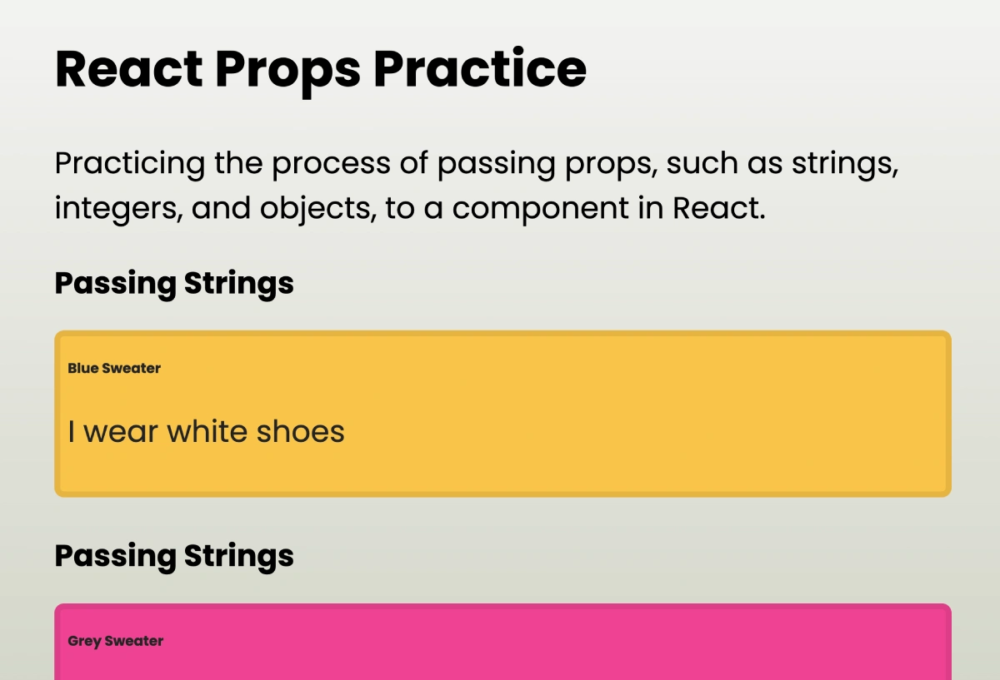

# Props Practrice
Practicing the process of passing props, such as strings, integers, and objects, to a component in React.

 

## Website
* 👉 [jsohndata.github.io/react-props-practice](https://jsohndata.github.io/react-props-practice/)

 

## Notes
* Banner1: Passing Strings
* Banner2: Passing an Object
* Banner3: Passing Object and Destructing
* Banner4: Passing String, Int, Object and Destructing
